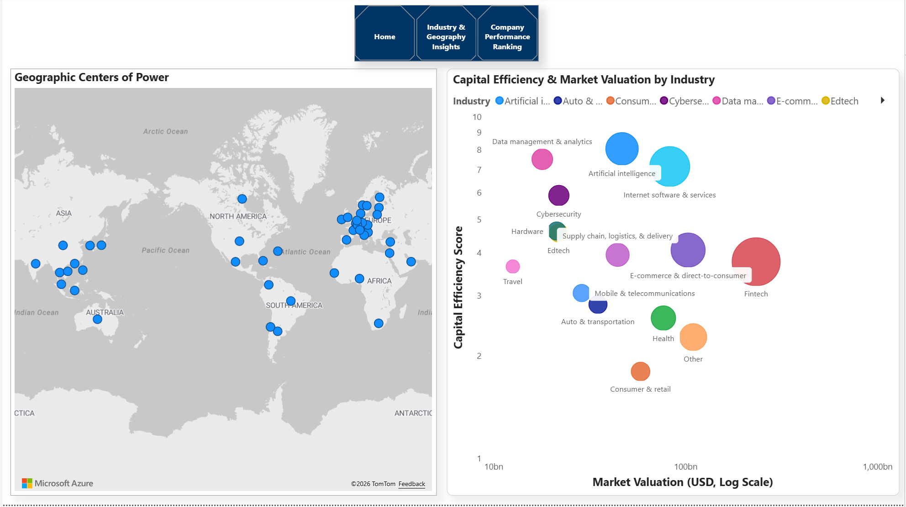
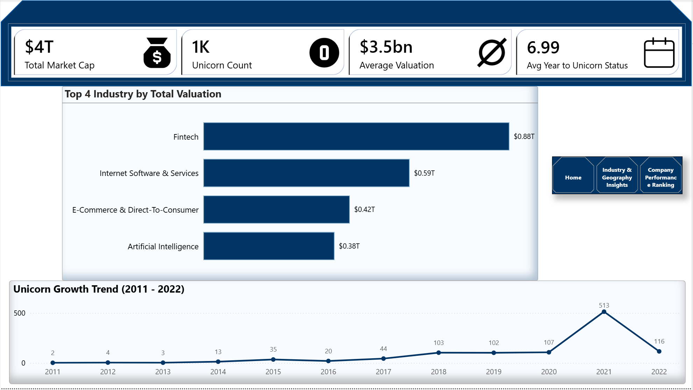

# Global Unicorn Companies Valuation Growth Dynamics & Capital Efficiency Analysis

# Executive Summary
This business intelligence project delivers an in-depth analysis of over 1,000 global unicorn companies possessing a cumulative valuation exceeding $4.0 Trillion USD. By synthesizing historical valuation growth, geographic hubs, industry sectors, and capital efficiency, this project identifies critical drivers behind high-growth private tech startups. The interactive Power BI report is designed for venture capital (VC) analysts, private equity investors, and strategic decision-makers to evaluate market maturity, funding runway velocity, and capital return multipliers.

# Business Context
Between 2011 and 2022, private market investing experienced extreme shifts—from steady long-term expansion to a venture capital surge in 2021, followed by market cooling. To navigate this volatility, investment firms require transparent benchmarks to answer critical strategic questions:
- Which tech sectors generate the highest market capitalization?
- How long does it typically take for a founding team to scale to a billion-dollar valuation?
- Which companies maximize return relative to the amount of external capital raised?

# Objectives
- Track Macro Trends: Analyze the year-over-year trajectory of companies achieving unicorn status from 2011 to 2022.
- Identify Sector Dominance: Evaluate industry market share across top valuation generators (Fintech, SaaS, E-commerce, AI).
- Assess Geographic Distribution: Map high-density innovation clusters and global hubs of private capital.
- Measure Capital Efficiency: Benchmark startups based on valuation generated per dollar of funding raised.

# Data Preview

# Key Findings
- Fintech Dominance: Fintech represents the largest single sector by total valuation ($0.88T), followed by Internet Software & Services ($0.59T).
- The 2021 Anomaly: A record 513 companies achieved unicorn status in 2021 alone, representing a massive liquidity spike compared to historical norms (~100–107 per year).
- Founding Runway: On average, startups take 6.99 years from founding to achieve a $1B+ valuation.
- Geographic Concentration: North America (United States) and East Asia (China/India) serve as the primary global centers of power in unicorn formation.

# Dashboard

Click the link to access the full report: [Click here](https://app.powerbi.com/view?r=eyJrIjoiN2RhZDUxODYtMDQwNy00ZTE4LThhZmYtMGU5OTIwYjU0MjJkIiwidCI6IjZjNzQ3Mzg1LTUyNTktNDcwMS05MTkzLTc5ZTkxNWNlYjA3ZSJ9)

# Data Cleaning and Transformation
### Power Query ETL Pipeline
- Extracted and cleaned raw currency text formats ($B, $M) into standardized numeric datatypes in USD Billions.
- Calculated time-to-milestone metrics using custom M formulas comparing founding years to unicorn dates.
- Handled missing values and standardized industry and geographic naming conventions for relational consistency.

# Data Modeling & DAX Measures
- Structured a dimensional Star Schema separating dimension tables (Company, Industry, Location, Date) from fact tables.
- Authored robust DAX measures for dynamic KPI cards, top-N industry aggregations, and capital efficiency multiples.

# Detailed Findings & Analysis
**1. Macro Valuation & Industry Concentration**
- Fintech ($0.88T) and Internet Software & Services ($0.59T) account for the majority share of private unicorn market capitalization. E-Commerce & Direct-to-Consumer ($0.42T) and Artificial Intelligence ($0.38T) form the second high-value tier.

**2. Growth Velocity (2011–2022)**
- From 2011 (2 unicorns) through 2020 (107 unicorns), global creation followed a steady upward trajectory. The 2021 liquidity boom resulted in 513 new unicorns before macroeconomic tightening brought 2022 additions to 116.

**3. Capital Efficiency Multiple Ranking**
- Evaluating valuation generated against total capital raised reveals high-efficiency outlier companies that generated strong enterprise value with minimal dilutive funding.

# Recommendations
- **Prioritize Capital Efficiency:** In a normalized macroeconomic environment, investment committees should prioritize startups demonstrating lean operating models and high valuation-to-funding ratios.
- **Focus on High-Margin Software & Infrastructure:** Enterprise SaaS and AI infrastructure continue to show robust recurring revenue multiples and defensible margins.
- **Explore Undervalued Geographic Hubs:** Broaden sourcing beyond high-cost coastal US hubs into accelerating innovation hubs across Europe and Asia with lower entry valuations.

# Tools Used
- **Microsoft Power BI:** Interactive report design, multi-page canvas, KPI cards, visual storytelling.
- **Power Query (M):** ETL processing, string cleaning, currency conversions, schema structuring.
- **DAX:** Calculated measures, ratio analysis, dynamic ranking, and filtering logic.
- **Microsoft Excel:** Initial dataset profiling, exploratory inspection, and source data management.

# Conclusion
- This project delivers a comprehensive, data-driven perspective on the global unicorn startup ecosystem. By combining historical growth timelines with sector valuations and capital efficiency metrics, the resulting dashboard translates raw venture capital data into clear, strategic intelligence for investment analysis and market benchmarking.
